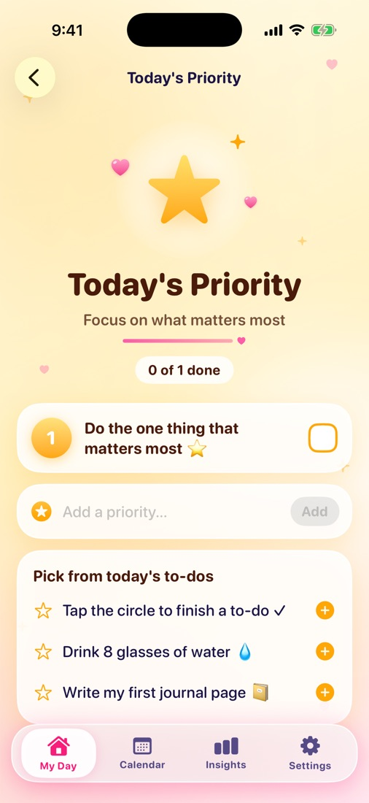
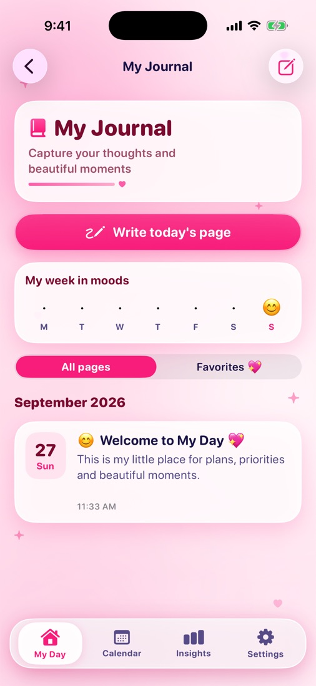
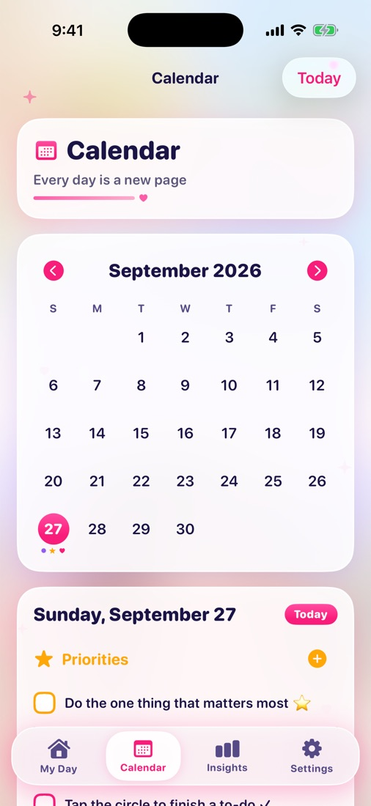

# My Day – To-Do & Journal 📔📝


A colourful, cosy iPhone app for planning the day, choosing what matters most,
and keeping a private journal. It is built with **SwiftUI** and **SwiftData**.

## Screenshots

Captured automatically in the iPhone 17 Pro simulator by CI.

| Home | Quick Add | Today's Priority | My Journal | Calendar |
| --- | --- | --- | --- | --- |
|  |  |  |  |  |

## Features

| Screen | What you can do |
| --- | --- |
| **My Day** (home) | The illustrated home screen from the design. The girl, pets and garden are an image; everything else is native SwiftUI: the ☰ menu, the "My Day" title, today's real date, the 🔔 reminders button, a daily message (it changes every day; tap it for another), the three feature cards with live badges, the pink **+** Quick Add menu and the floating tab bar. |
| **Today's To-Dos** | Add to-dos inline or in detail (category, date, time, repeat, reminder, note). Tick them off, drag to reorder, swipe to delete, filter by category, and watch the progress ring. Finishing a repeating to-do creates the next one. |
| **Today's Priority** | Numbered golden cards for the few things that matter most. Add, edit, reorder and complete them, or pick one from today's to-dos. |
| **My Journal** | Pages with a mood, title, text, writing prompts and up to 6 photos. Search, favourites, a "week in moods" strip, and an optional **Face ID lock**. |
| **Calendar** | Month grid with markers for to-dos, priorities and journal pages, plus the selected day's agenda. |
| **Insights** | Done today, day streak, a weekly bar chart and a 30-day mood chart (Swift Charts). |
| **Settings** | Your name, morning and evening reminders, carrying unfinished items over to today, haptics, the journal lock, and data clean-up. |

Everything is stored on the device with SwiftData, so data stays between launches.
The app makes no network calls. It asks for notification permission only when
you first switch on a reminder.

## Data model

| Model | Fields |
| --- | --- |
| `TaskItem` (the spec's *Task*; `Task` is Swift's concurrency type) | id, title, category, date, time, reminderEnabled, reminderDate, repeatOption, isCompleted, createdAt (+ notes, completedAt, seriesID, sortOrder) |
| `Priority` | id, title, date, order, isCompleted (+ completedAt, createdAt) |
| `JournalEntry` | id, date, title, body, mood, photos (`[JournalPhoto]`), createdAt, updatedAt (+ isFavorite) |
| `JournalPhoto` | id, imageData (stored outside the database), thumbnailData, order |

## Requirements

- Xcode 16 or newer
- iOS 17.0 or newer, iPhone (portrait)

## Run it

1. Open `MyDay.xcodeproj` in Xcode.
2. Select the **MyDay** target → *Signing & Capabilities*. Choose your Team and,
   if needed, change the bundle identifier (`com.regina3579.myday`).
3. Pick an iPhone simulator or your iPhone, then press **Run** (⌘R).

## Project structure

```
MyDay/
├── App/            App entry, navigation (Router), UIKit appearance
├── Models/         SwiftData models: TaskItem, Priority, JournalEntry, JournalPhoto
├── Services/       Reminders, Face ID lock, haptics, day rollover, helpers
├── Theme/          Colours from the artwork, fonts, shared components
├── Features/
│   ├── Root/       RootView, BottomTabBar, side menu
│   ├── Home/       HomeView, HomeHeader, DailyQuoteView, HomeFeatureCard,
│   │               QuickAddButton / QuickAddMenu, card illustrations
│   ├── Todos/      TodayToDosView, NewTaskSheet
│   ├── Priority/   TodaysPriorityView, NewPrioritySheet
│   ├── Journal/    JournalView, JournalDetailView, NewJournalEntrySheet, lock screen
│   ├── Calendar/   CalendarView
│   ├── Insights/   InsightsView
│   └── Settings/   SettingsView, RemindersView
└── Assets.xcassets App icon, home scene illustration, colours
```

## How the home screen is built

Only the scenery is an image: `HomeScene` is the sky, castle and garden with
the girl, the puppy and the kitten. The old title, message and cards were
painted out of it. Everything on top is native SwiftUI: `HomeHeader`,
`DailyQuoteView`, three `HomeFeatureCard`s drawn with vector shapes, and
`QuickAddButton` + `QuickAddMenu`, with `BottomTabBar` from the root view.
Sizes follow the screen width, so the layout keeps the design's proportions
on every iPhone, and the screen scrolls when it does not fit (for example on
iPhone SE).

## Continuous integration

`.github/workflows/ios-build.yml` builds the app for the iOS Simulator on every
push and pull request. It then runs `scripts/screenshots.sh`, which opens every
main screen in the iPhone simulators and uploads the screenshots as a build
artifact. Running the workflow by hand with *publish_screenshots* also commits small
JPEG copies to `docs/screenshots/`. You can run the script on a Mac too:
`./scripts/screenshots.sh`.
