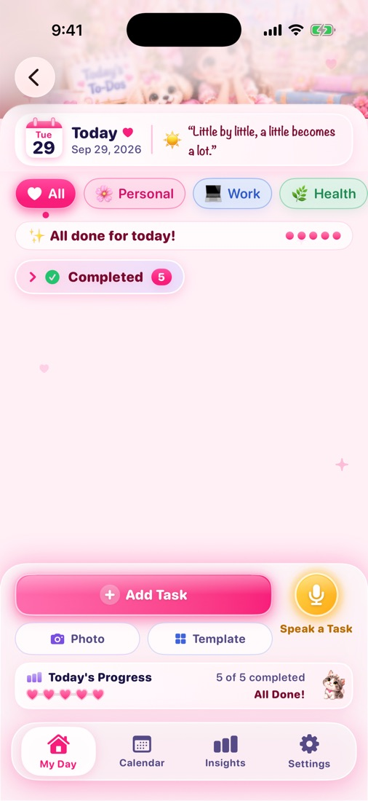
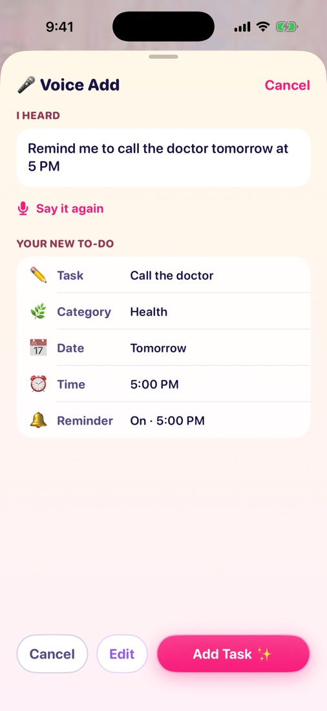
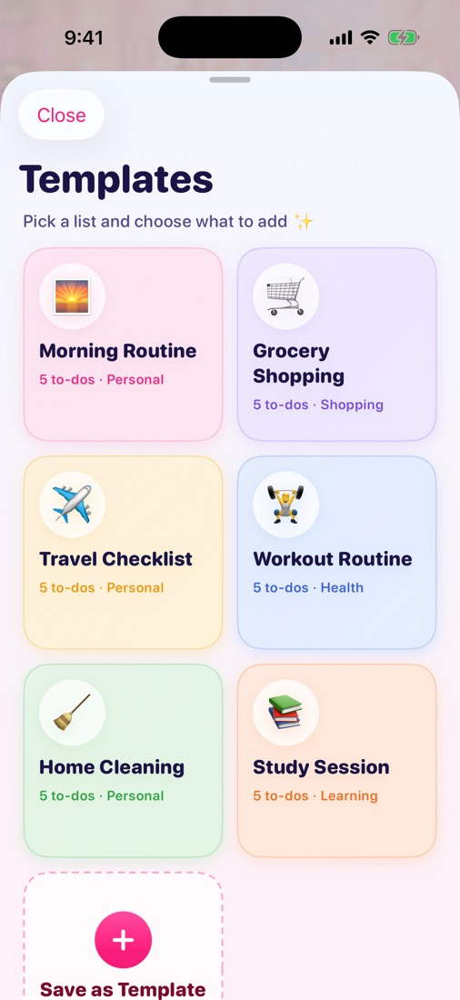
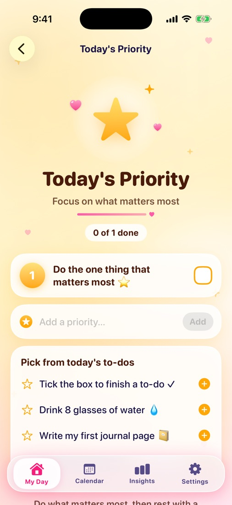
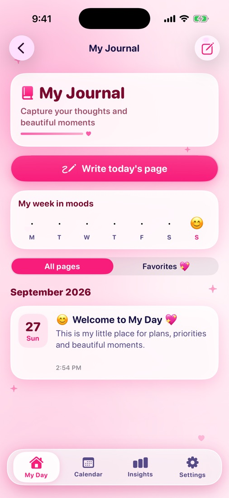
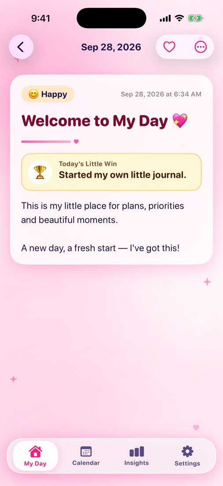
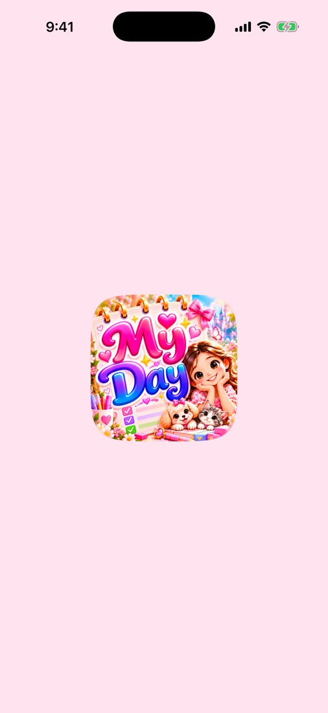
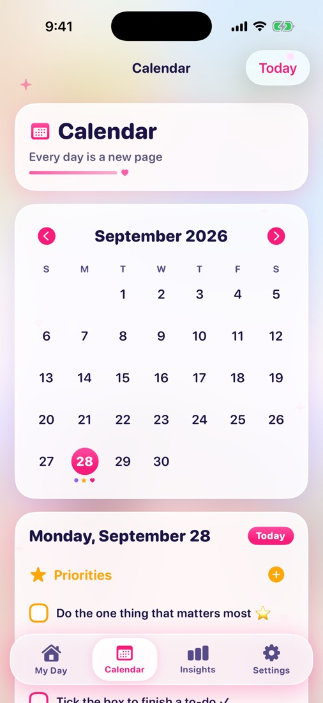
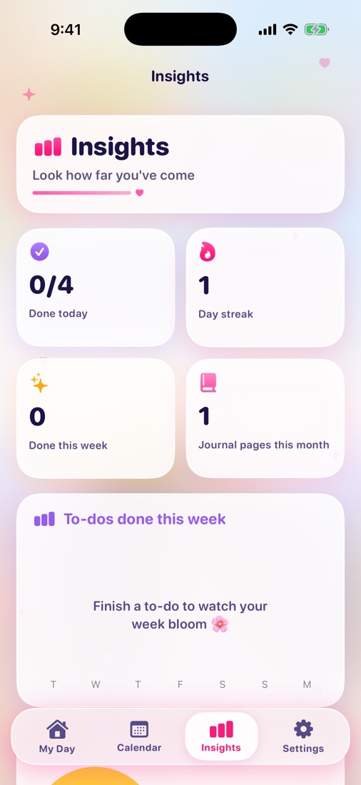
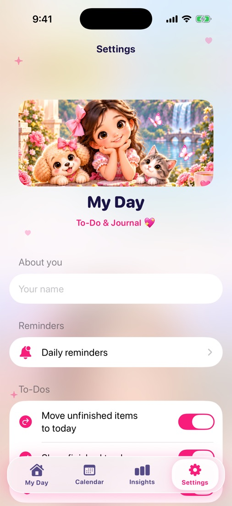

# My Day – To-Do & Journal 📔📝


A colourful, cosy iPhone app for planning the day, choosing what matters most,
and keeping a private journal. It is built with **SwiftUI** and **SwiftData**.

## Screenshots

Captured automatically in the iPhone 17 Pro simulator by CI.

| Home | Today's To-Dos | All Done ✨ | Add a Task | Voice Add |
| --- | --- | --- | --- | --- |
|  |  |  |  |  |

| Templates | Quick Add menu | Today's Priority | My Journal | A Journal Page |
| --- | --- | --- | --- | --- |
|  |  |  |  |  |

| Write a Page | Calendar | Insights | Settings |
| --- | --- | --- | --- |
|  |  |  |  |

## Features

| Screen | What you can do |
| --- | --- |
| **My Day** (home) | The illustrated home screen from the design. The girl, pets and garden are an image; everything else is native SwiftUI: the ☰ menu, the "My Day" title, today's real date, the 🔔 reminders button, **Daily Motivation** (a short hand-written quote from 112 built-in quotes about happiness, productivity, gratitude, self-belief, consistency, peaceful living and progress; it stays the same all day, changes after midnight and works offline), the three feature cards with live badges, the pink **+** Quick Add menu and the floating tab bar. |
| **Today's To-Dos** | The illustrated header, today's date with a daily quote, category chips (All, Personal, Work, Health, Learning, Shopping) and soft pastel rows such as "Health · 5:00 PM 🔔". The box on the left ticks a to-do off; the little ✏️ on the right opens a menu: Edit, Change date/time, Add reminder, Repeat, Move to Priority and Delete. Swipe a to-do to the left to delete it, tap it for its details, or press and hold to drag it to a new place. **Daily Progress** sits at the top of the list: "Today ✨ 3 of 5 completed ● ● ● ○ ○"; when every to-do is done it says "✨ All done for today!" and plays a tiny sparkle burst (skipped with Reduce Motion). The **Today's Progress** card below shows a heart for every to-do. Finishing a repeating to-do creates the next one. |
| **Five ways to add** | ➕ **Add a New Task**: a pastel sheet where only the title is needed; category, date & time, reminder, repeat, photo and note are optional. ⚡ **Quick Add**: type in "What needs doing?" and press Add or Return; it goes on today with no reminder or repeat, and the sheet stays open for the next one. 🎤 **Voice**: Apple's Speech framework (on the device when supported) turns what you say into text; My Day spots words like *today*, *tomorrow*, *at 5 PM*, *every day* and category words, then shows a preview (Task, Category, Date, Time, Reminder) with Cancel, Edit and Add Task. Nothing is saved without your tap, and guesses are pointed out. 📷 **Photo**: take or choose a photo, add the title and details, and save; view it full size, replace it or remove it later. ▦ **Templates**: Morning Routine, Grocery Shopping, Travel Checklist, Workout Routine, Home Cleaning and Study Session; untick what you don't need and tap "Add to My Day". "Save as Template" keeps your own lists on the device. |
| **Today's Priority** | Numbered golden cards for the few things that matter most. Add, edit, reorder and complete them, or pick one from today's to-dos. |
| **My Journal** | Pages with a mood, title, text, writing prompts and up to 6 photos. **Today's Little Win 🏆** is one optional line on each page ("🌟 My little win today…", such as "Called my mom."); it shows as a gold ribbon on the page, and the **Little Wins 🏆** shelf collects them all, so the journal becomes a collection of little achievements. Search (titles, text and wins), favourites, a "week in moods" strip, and an optional **Face ID lock**. |
| **Calendar** | Month grid with markers for to-dos, priorities and journal pages, plus the selected day's agenda. |
| **Insights** | Done today, day streak, a weekly bar chart and a 30-day mood chart (Swift Charts). |
| **Settings** | Your name, morning and evening reminders, carrying unfinished items over to today, haptics, the journal lock, and data clean-up. |

Everything is stored on the device with SwiftData, so data stays between launches.
The app itself makes no network calls. Permissions are asked for only when a
feature needs them: notifications when you first switch on a reminder, the
microphone and speech recognition when you first use Voice Add, and the camera
when you first take a photo. If one is turned off, My Day explains how to turn
it on in Settings and offers another way (for example, typing instead of speaking).

## Data model

| Model | Fields |
| --- | --- |
| `TaskItem` (the spec's *Task*; `Task` is Swift's concurrency type) | id, title, category (Personal, Work, Health, Learning, Shopping), date, time, reminderEnabled, reminderDate, repeatOption, isCompleted, createdAt (+ notes, completedAt, seriesID, sortOrder, photoData stored outside the database, photoThumbnail) |
| `TaskTemplate` | id, name, emoji, category, items, createdAt — the templates you save yourself |
| `Priority` | id, title, date, order, isCompleted (+ completedAt, createdAt) |
| `JournalEntry` | id, date, title, body, mood, photos (`[JournalPhoto]`), createdAt, updatedAt (+ isFavorite, littleWin) |
| `JournalPhoto` | id, imageData (stored outside the database), thumbnailData, order |

## Requirements

- Xcode 16 or newer
- iOS 17.0 or newer, iPhone (portrait)

## Run it

1. Open `MyDay.xcodeproj` in Xcode.
2. Select the **MyDay** target → *Signing & Capabilities*. Choose your Team and,
   if needed, change the bundle identifier (`com.regina3579.myday`).
3. Pick an iPhone simulator or your iPhone, then press **Run** (⌘R).

## Project structure

```
MyDay/
├── App/            App entry, navigation (Router), UIKit appearance
├── Models/         SwiftData models: TaskItem, TaskTemplate, Priority, JournalEntry,
│                   JournalPhoto; TaskDraft (an unsaved to-do)
├── Services/       Reminders, speech (SpeechTranscriber, VoiceTaskParser),
│                   Face ID lock, haptics, day rollover, helpers
├── Theme/          Colours from the artwork, fonts, shared components
├── Features/
│   ├── Root/       RootView, BottomTabBar, side menu
│   ├── Home/       HomeView, HomeHeader, DailyQuoteView, HomeFeatureCard,
│   │               QuickAddButton / QuickAddMenu, card illustrations
│   ├── Todos/      TodayToDosView, TodoComponents (rows, ✏️ menu, progress),
│   │               NewTaskSheet, QuickAddTaskSheet, VoiceTaskSheet,
│   │               TemplatePickerSheet, TaskPhotoViews
│   ├── Priority/   TodaysPriorityView, NewPrioritySheet
│   ├── Journal/    JournalView, JournalDetailView, NewJournalEntrySheet, lock screen
│   ├── Calendar/   CalendarView
│   ├── Insights/   InsightsView
│   └── Settings/   SettingsView, RemindersView
└── Assets.xcassets App icon, home and to-dos scene illustrations, kitten, colours
```

## How the home screen is built

Only the scenery is an image: `HomeScene` is the sky, castle and garden with
the girl, the puppy and the kitten. The old title, message and cards were
painted out of it. Everything on top is native SwiftUI: `HomeHeader`,
`DailyQuoteView`, three `HomeFeatureCard`s drawn with vector shapes, and
`QuickAddButton` + `QuickAddMenu`, with `BottomTabBar` from the root view.
Sizes follow the screen width, so the layout keeps the design's proportions
on every iPhone, and the screen scrolls when it does not fit (for example on
iPhone SE).

The To-Dos screen works the same way: only `TodosScene` (the sign, the girl and
her puppy) and `ProgressKitten` are images. The date card, chips, rows, buttons,
hearts and the "You're Doing Great!" badge are SwiftUI views.

The tab bar floats over the screens, so `RootView` publishes the height it
covers (`tabBarClearance`) and every screen keeps its content clear of it with
`tabBarSafeArea()`.

## Continuous integration

`.github/workflows/ios-build.yml` builds the app for the iOS Simulator on every
push and pull request. It then runs `scripts/screenshots.sh`, which opens every
main screen in the iPhone simulators and uploads the screenshots as a build
artifact. Running the workflow by hand with *publish_screenshots* also commits small
JPEG copies to `docs/screenshots/`. You can run the script on a Mac too:
`./scripts/screenshots.sh`.
